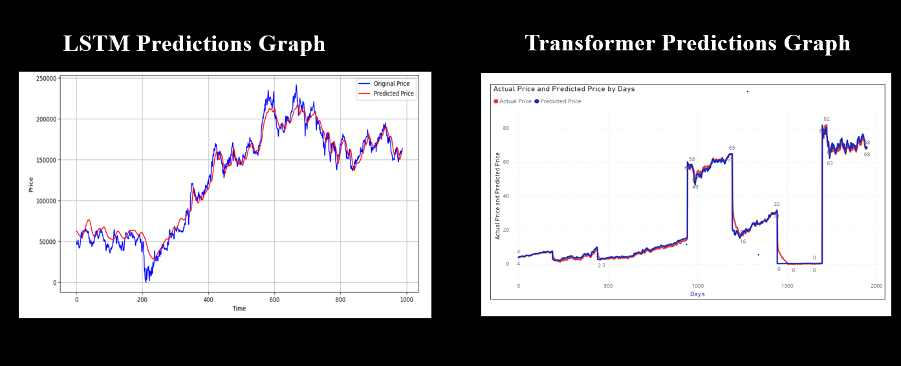

# Stock Price Prediction with LSTM and Transformer Models

## Overview
This project implements and compares two deep learning approaches for stock price prediction using historical data from Yahoo Finance (yfinance). The models include Long Short-Term Memory (LSTM) networks and Transformer-based architectures to forecast future stock prices based on historical patterns.

## Features
- Data acquisition using the yfinance library
- Comprehensive data preprocessing and feature engineering
- Implementation of LSTM model for time series forecasting
- Implementation of Transformer model for sequence prediction
- Visualization of actual vs. predicted prices for model evaluation
- Performance metrics comparison between models

## Results
As shown in the visualization outputs, both models demonstrate strong predictive capabilities:

- **LSTM Model**: Shows consistent tracking of price movements with smooth predictions across the entire time range, handling both stable periods and rapid changes effectively.
- **Transformer Model**: Demonstrates precise prediction capabilities with particularly strong performance during price transitions, though with some distinct behaviors across different price ranges.

## Requirements
```
python>=3.8
tensorflow>=2.6.0
yfinance>=0.1.63
pandas>=1.3.0
numpy>=1.19.5
matplotlib>=3.4.0
scikit-learn>=0.24.2
```


## Contributing
Contributions are welcome! Please feel free to submit a Pull Request.

## Contact
For questions or feedback, please open an issue in the repository or contact [muhammadalinasir00786@gmail.com].